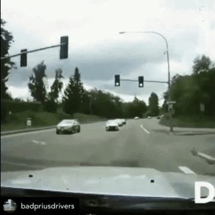
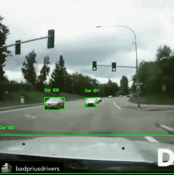
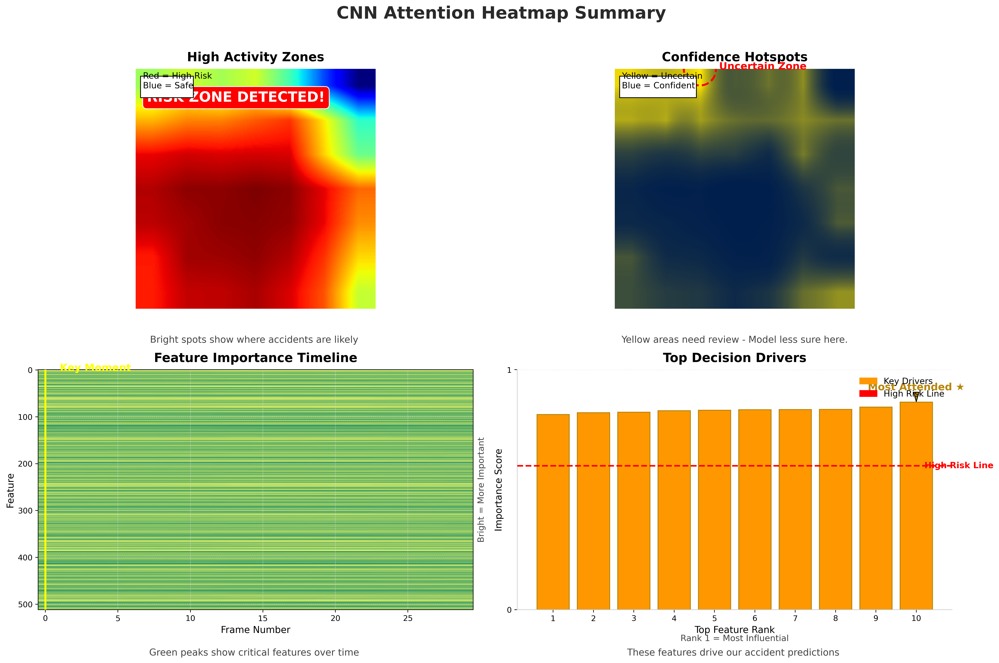

# CrashSight – Real-Time Accident Detection with AI

CrashSight is a real-time car crash detection system that combines fast object tracking with deep scene understanding to identify accidents as they happen. It’s designed for real-world deployment on traffic footage — smart intersections, fleet monitoring, or dashcams.

---

##  What It Does

- Detects vehicle collisions from raw video using computer vision
- Tracks object motion and dynamics across time
- Classifies crash patterns using an attention-enhanced CNN
- Outputs annotated clips, attention maps, and structured crash reports

---
## System Overview

CrashSight is built on a two-stage pipeline that intelligently combines real-time motion analytics with deep contextual scene understanding. This hybrid approach ensures **robust detection** even in edge cases, striking a balance between **speed**, **accuracy**, and **interpretability**.

### 1. Vehicle Tracking & Motion Risk Analysis (Fast, Interpretable)

* **YOLOv8** serves as the foundation for high-speed, per-frame vehicle detection, optimized for real-time video.
* A custom **Centroid Tracker** computes motion dynamics like speed, acceleration, and trajectory deviation per vehicle.
* Accidents are flagged when:

  * **Bounding boxes intersect** (suggesting physical proximity)
  * **Motion patterns break expectation**, such as sudden stops or erratic turns

➤ *Why this matters*: This stage ensures the system is **fast and explainable**, making it perfect for smart cameras or embedded deployments.

### 2. Scene Understanding via Attention CNN (Deep Crash Semantics)

* Powered by **ResNet18 + Temporal Shift Module (TSM)** for spatio-temporal learning.
* **CBAM (Attention Block) + Multi-Head Attention** allows the network to focus on critical visual cues like impact regions, sudden changes, or vehicular deformation.
* Trained on 1,000+ annotated crash videos to recognize complex real-world accident types (rear-end, side-swipe, etc.)
* Uses **Grad-CAM++** for visualizing what the model is attending to.

➤ *Why this matters*: This module adds **semantic depth**, enabling the system to reason about crashes — not just detect motion anomalies.

### Smart Triggering Logic

By default, Module 2 is invoked **only when Module 1 detects a high-risk event**, significantly reducing compute load:

```python
final_score = α * motion_score + β * scene_score
```

For high-end GPUs or latency-insensitive use cases, both modules can run in parallel and fuse outputs for maximum accuracy.

➤ *Why this matters*: This design makes CrashSight scalable — light enough for edge devices, yet deep enough for cloud analytics.

### Outputs You Can Trust

* 📹 **Annotated Video**: Bounding boxes, IDs, speeds, crash tags
* 🌡️ **Attention Heatmaps**: Visual explanation of crash decision
* 📝 **Crash Reports**: Structured logs in JSON + human-readable format
* 🎞️ **Crash Clips**: Automatically segmented and saved (annotated + raw)

➤ *Why this matters*: These outputs ensure transparency, auditability, and ease of integration for downstream systems (e.g., insurance APIs, traffic dashboards).


---

##  Key Features

- Real-time: ~30 FPS (GPU) or 10–15 FPS (CPU)
- Risk scoring based on motion vectors + collision angles
- Scene classification with attention maps
- Velocity and acceleration tracking per vehicle
- Collision type estimation (e.g. rear-end, side-impact)
- Auto-generated video segments for detected crashes

---

##  Project Structure

```
main.py                 # Core crash detection pipeline
models/                 # YOLO + CNN weights
app/                    # Web/API interface
utils/                  # Video processing tools
static/                 # Outputs, heatmaps, visual assets
```

---

##  Technical Stack

| Component               | Tech Used                              |
|------------------------|-----------------------------------------|
| Object Detection        | YOLOv8                                  |
| Motion Tracking         | Custom CentroidTracker                  |
| Scene Classifier        | ResNet18 + TSM + CBAM + MHA             |
| Video Processing        | OpenCV, FFmpeg                          |
| Heatmap Visualization   | Grad-CAM++, Matplotlib                  |
| Backend/API             | FastAPI                                 |
| Deployment Format       | ONNX, MP4, JSON                         |

---

##  Results

- **99% accuracy** on test set (1,000+ crash/no-crash clips)
- Detects edge cases missed by motion-only or scene-only models
- Auto-tags: rear-end, side-impact, angled collisions
- Generates structured reports (with velocity & class info)

---

---

## Demo

Here’s a real example showing how CrashSight processes a traffic video:

| Raw Input Video | Annotated Output |
|-----------------|------------------|
|  |  |

  Below is the attention heatmap from the CNN, showing **what the model focused on** when confirming the crash:



  And here's an auto-generated crash report:

---

### ACCIDENT #1
**Frame:** 31  
**Time:** 1.03 seconds  

**Vehicle 1 (ID 1)**  
• Class: Car  
• Confidence: 0.91  

**Vehicle 2 (ID 3)**  
• Class: Car  
• Confidence: 0.63  

**Risk Score:** 0.783

---


##  Usage

### 1. Install Requirements

```bash
pip install -r requirements.txt
```

### 2. Run Detection on a Video

```bash
python main.py
```

Modify the paths in `main.py` to point to your input `.mp4` file and output directory.

### 3. Output Files

After processing, you'll get:

- `output_full.mp4` – Full annotated video  
- `*_accident_*.mp4` – Short clips for detected events  
- `collision_report.txt` – Human-readable crash logs  
- `attention_summary.png` – CNN attention visualization  

---

##  Real-World Applications

- **Traffic Surveillance:** Monitor intersections for accidents in real time  
- **Fleet Monitoring:** Detect high-risk behavior across company vehicles  
- **Insurance:** Automatic documentation for claims  
- **Smart Cities:** Real-time road safety analysis  
- **Research:** Study vehicle dynamics in real-world crashes  

---

##  Future Improvements

- Integrate LSTM/GRU for longer temporal context  
- Expand crash taxonomy (e.g., near-miss, pedestrian events)  
- Optimize for edge deployment 

---
